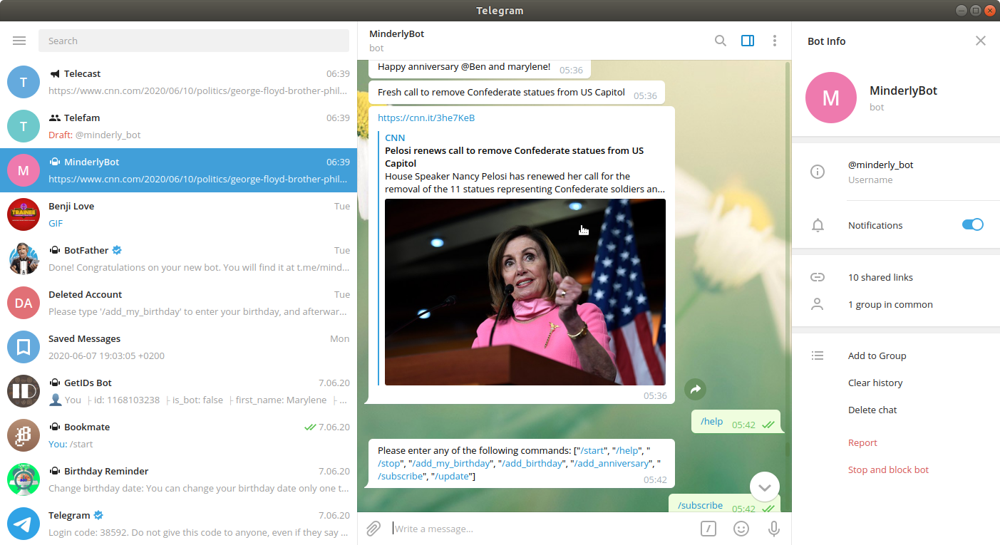

# minderly-bot

This is a capstone project at the end of the main Ruby curriculum at [Microverse](https:www.microverse.org/) - @microverseinc.



## Built With

- Ruby 

## Description
- This is a date checker. It keeps track of all your important events, such as birthdays, anniversaries, etc and sends out message notifications.
- It also sends out RSS feeds to subscribed users and channels.

- The [Telegram Bot Api](https://core.telegram.org/bots/api) was used to build this project.

## Live Demo

[Live Demo]()

### Run instructions 
-  You can clone the GitHub repo and type the following commands in the terminal to run the bot locally 
#### Setting Environment Variables
- You can set environment variables locally by creating `.env` file with the following
   ```
    token='bot_token'
    group_id='group_id'
    channel_id='channel_id'
    default_chat_id=chat_id
    ```
  -  Then run the following commands in the terminal inside the project's root directory
    ```
    bundle install
    ruby ./bin/bot_runner.rb
    ```

 Alternatively, you can create an executable script to run it.
- To add the bot to Telegram, one has to create a Telegram bot account for it using BotFather, and connect to it using the API obtained token.

### How to use the bot
Make sure the bot is running
- In order to use MinderlyBot one has to have a Telegram account.
- Ordinary users are able to interact with the bot via their Telegram accounts.
- The bot is also able to post messages to channels and groups if it is added as an administrator.
- You can also subscribe channels as users, and channels as well as group members are able to interact
  with the bot.

### Available commands
- Please enter any of the following commands: ["/start", "/help", "/stop", "/news", "/add_my_birthday", "/add_birthday", "/add_anniversary", "/subscribe", "/update"]

### Possible errors
- An incorrect entry for the date might throw a `Date.parse` error: 
   - Example of an invalid date format
       - "769887/22/98"
   - Bot Response:
       - "invalid date: Incorrect format for birthday date entry."
- Make sure you enter the date in the proposed format.
- Correct entries for date
    - Should be in the format "DD/MM/YYYY", for example, "12/06/1993" 

### Run Tests
`rspec --format doc`

### Alternatively you can use npm commands after [installing node and npm](https://docs.npmjs.com/downloading-and-installing-node-js-and-npm) on your machine
- `npm start` to run the bot
- `npm test` to run the tests

## Deployment
- You can deploy on [Heroku](https://devcenter.heroku.com/categories/ruby-support) and run the app in the console via `Heroku run` or recreate the bot application using the rails framework in order to deploy the bot with a Procfile.

## Potential Future Improvements / Ambitions
- Recreate the bot using a framework such as rails or sinatra.
- Add integration to [Google Calendar API](https://console.developers.google.com) in order to access national public holidays for the user.

## Authors

👤 **Marylene Sawyer**
- Github: [@Bluette1](https://github.com/Bluette1)
- Twitter: [@MaryleneSawyer](https://twitter.com/MaryleneSawyer)
- Linkedin: [Marylene Sawyer](https://www.linkedin.com/in/marylene-sawyer-b4ba1295/)

# Acknowledgements
- [Creating a Bot using the Telegram Bot API](https://tutorials.botsfloor.com/creating-a-bot-using-the-telegram-bot-api-5d3caed3266d#.13ywsygju)

- There are great samples at [this site](https://core.telegram.org/bots/samples)
- To read more about RSS feeds visit [this Medium site](https://medium.com/@krandles/rss-and-ruby-its-really-simple-a32a8654733a)

## 🤝 Contributing

Contributions, issues and feature requests are welcome!

Feel free to check the [issues page](https://github.com/Bluette1/minderly-bot/issues).

## Show your support

Give a ⭐️ if you like this project!

## 📝 License

This project is [MIT](https://opensource.org/licenses/MIT) licensed.
